#### Marco Manuel Fernánez Pranno - SPSI 2016
#### [Repositorio de la práctica](https://github.com/MarFerPra/learning-openssl)

## Tareas a realizar

#### 1. Crear archivo binario de 1024 bits, todo a 0. (input.bin)

#### 2. Crear archivo binario de 1024 bits, un bit a 1 entre los primeros 40, el resto todo a 0. (input1.bin)

#### 3. Cifrar input.bin con DES en modo ECB, CBC y 0FB; usando una clave débil y otra semidébil. (Cualquier vector de inicialización)

  - ##### 3.1.  DES con clave débil, modos ECB, CBC y OFB:

  `openssl des-ecb -nosalt -in input.bin -out input0-des-ecb-debil.enc -K 0000000`  
  `openssl des-cbc -nosalt -in input.bin -out input0-des-cbc-debil.enc -iv 00000000 -K 0000000`  
  `openssl des-ofb -nosalt -in input.bin -out input0-des-ofb-debil.enc -iv 00000000 -K 0000000`  

  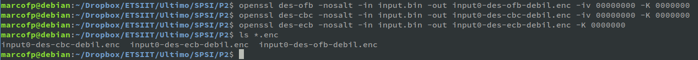

  - ##### 3.2.  DES con clave semi-débil, modos ECB, CBC y OFB:

  `openssl des-ecb -nosalt -in input.bin -out input0-des-ecb-semidebil.enc -K 01FE`  
  `openssl des-cbc -nosalt -in input.bin -out input0-des-cbc-semidebil.enc -iv 00000000 -K 01FE`  
  `openssl des-ofb -nosalt -in input.bin -out input0-des-ofb-semidebil.enc -iv 00000000 -K 01FE`

    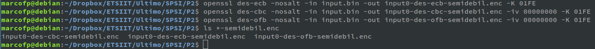

#### 4. Cifrar input.bin e input1.bin con DES en modo ECB y clave a elegir. Explicar la forma de los resultados obtenidos.

- ##### 4.1. Input.bin DES modo ECB (clave semidébil):
  `openssl des-ecb -nosalt -in input.bin -out input0-des-ecb-semidebil.enc -K 01FE`

- ##### 4.2. Input1.bin DES modo ECB (clave semidébil):
  `openssl des-ecb -nosalt -in input1.bin -out input1-des-ecb-semidebil.enc -K 01FE`

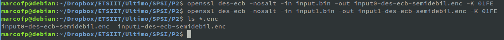

- ##### 4.3. Comparación de resultados:

Vemos en ambos casos, debido a la naturaleza del algoritmo de cifrado, que se repite un patrón dentro del archivo cifrado; en ambos casos ocurre lo mismo pero con un patrón diferente que difiere en un sólo caso, el bit de diferencia entre ellos.  

  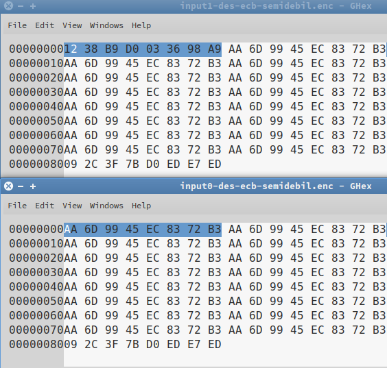

#### 5. Cifrar input.bin e input1.bin con DES en modo CBC, clave y vector de inicialización a elegir. Comparar resultados con el apartado anterior.

- ##### 5.1. Input.bin DES modo CBC (clave débil, todo 1), vector de inicialización todo 0:

  `openssl des-cbc -nosalt -in input.bin -out input0-des-cbc-semidebil.enc -iv 00000000 -K 11111111`

- ##### 5.2. Input1.bin DES modo CBC (clave débil, todo 1), vector de inicialización todo 0:

  `openssl des-cbc -nosalt -in input1.bin -out input1-des-cbc-semidebil.enc -iv 00000000 -K 11111111`

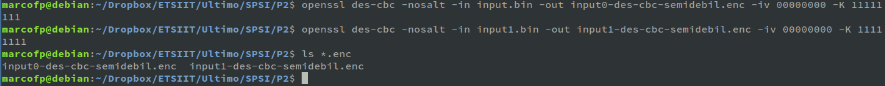

- ##### 5.3. Comparación de resultados:

Vemos como gracias a la aplicación de un vector de incialización y la diferencia del algoritmo CBC frente a ECB los patrones evidentes del apartado anterior en el texto cifrado desaparecen y no se aprencia rastro de ninguno. Deducimos de ésto que ECB es un cifrado más sencillo (más débil), frente a CBC que ofusca de una forma más efectiva el contenido del archivo.  

  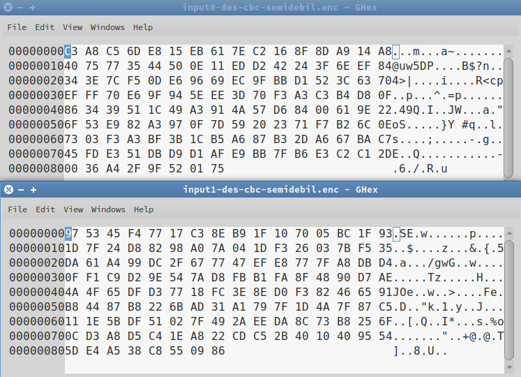

#### 6. Repetir los puntos 3 a 5 con AES-128 y AES-256.

#####  (3) Cifrar input.bin con AES-128 y AES-256 en modo ECB, CBC y 0FB; usando una clave débil y otra semidébil. (Cualquier vector de inicialización)

- ##### 6.1. AES-128:

  - ##### 6.1.1. Modo ECB:
    - Clave débil:  
    `openssl aes-128-ecb -nosalt -in input.bin -out input0-aes128-ecb-debil.enc -K 11111111`
    - Clave semidébil:  
    `openssl aes-128-ecb -nosalt -in input.bin -out input0-aes128-ecb-semidebil.enc -K 01FE`
  - ##### 6.1.2. Modo CBC:
    - Clave débil:  
    `openssl aes-128-cbc -nosalt -in input.bin -out input0-aes128-cbc-debil.enc -iv 00000000 -K 11111111`
    - Clave semidébil:  
    `openssl aes-128-cbc -nosalt -in input.bin -out input0-aes128-cbc-semidebil.enc -iv 00000000 -K 01FE`
  - ##### 6.1.3. Modo OFB:
    - Clave débil:  
    `openssl aes-128-ofb -nosalt -in input.bin -out input0-aes128-ofb-debil.enc -iv 00000000 -K 11111111`
    - Clave semidébil:  
    `openssl aes-128-ofb -nosalt -in input.bin -out input0-aes128-ofb-semidebil.enc -iv 00000000 -K 01FE`

- ##### 6.2. AES-256:

  - ##### 6.2.1. Modo ECB:
    - Clave débil:  
    `openssl aes-256-ecb -nosalt -in input.bin -out input0-aes256-ecb-debil.enc -K 11111111`
    - Clave semidébil:  
    `openssl aes-256-ecb -nosalt -in input.bin -out input0-aes256-ecb-semidebil.enc -K 01FE`
  - ##### 6.2.2. Modo CBC:
    - Clave débil:  
    `openssl aes-256-cbc -nosalt -in input.bin -out input0-aes256-cbc-debil.enc -iv 00000000 -K 11111111`
    - Clave semidébil:  
    `openssl aes-256-cbc -nosalt -in input.bin -out input0-aes256-cbc-semidebil.enc -iv 00000000 -K 01FE`
  - ##### 6.2.3. Modo OFB:
    - Clave débil:  
    `openssl aes-256-ofb -nosalt -in input.bin -out input0-aes256-ofb-debil.enc -iv 00000000 -K 11111111`
    - Clave semidébil:  
    `openssl aes-256-ofb -nosalt -in input.bin -out input0-aes256-ofb-semidebil.enc -iv 00000000 -K 01FE`

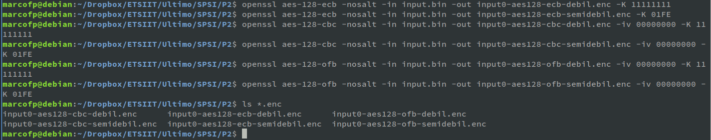

##### (4) Cifrar input.bin e input1.bin con AES-128 y AES-256 en modo ECB y clave a elegir. Explicar la forma de los resultados obtenidos.

`openssl aes-128-ecb -nosalt -in input.bin -out input0-aes128-ecb-debil.enc -K 11111111`
`openssl aes-256-ecb -nosalt -in input.bin -out input0-aes256-ecb-debil.enc -K 11111111`
`openssl aes-128-ecb -nosalt -in input1.bin -out input1-aes128-ecb-debil.enc -K 11111111`
`openssl aes-256-ecb -nosalt -in input1.bin -out input1-aes256-ecb-debil.enc -K 11111111`

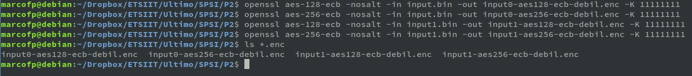

  - ##### Comparación:
  Igual que en el caso del ejercicio 4 con DES, vemos como se repiten patrones en el texto cifrado, variando estos en cada fichero.

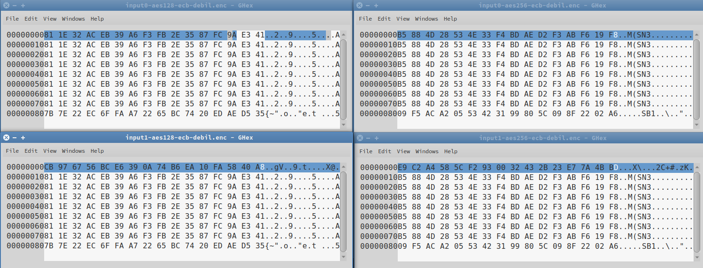

##### (5) Cifrar input.bin e input1.bin con AES-128 y AES-256 en modo CBC, clave y vector de inicialización a elegir. Comparar resultados con el apartado anterior.

`openssl aes-128-cbc -nosalt -in input.bin -out input0-aes128-cbc-debil.enc -iv 00000000 -K 11111111`  
`openssl aes-256-cbc -nosalt -in input.bin -out input0-aes256-cbc-debil.enc -iv 00000000 -K 11111111`  
`openssl aes-128-cbc -nosalt -in input1.bin -out input1-aes128-cbc-debil.enc -iv 00000000 -K 11111111`  
`openssl aes-256-cbc -nosalt -in input1.bin -out input1-aes256-cbc-debil.enc -iv 00000000 -K 11111111`  

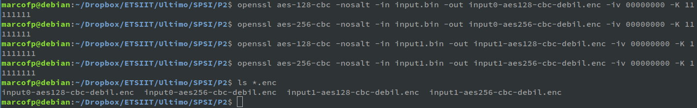

- ##### Comparación:
De nuevo, igual que en el caso del ejercicio 5 con DES, los patrones en el texto cifrado desaparecen al aplicar el algoritmo CBC frente al ECB, haciendo uso de un vector de inicialización y gracias a las operaciones XOR.

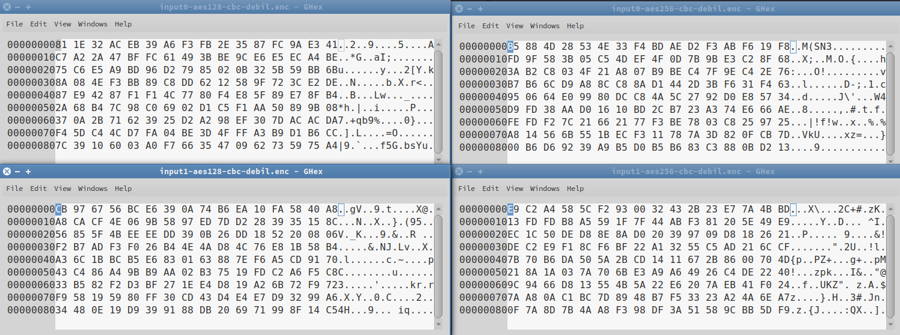

#### 7. Cifrar input.bin con AES-192 en modo 0FB, clave y vector de inicialización a elegir. (Salida output.bin)

  `openssl aes-192-ofb -nosalt -in input.bin -out output.bin -iv 00000000 -K 01FE`

  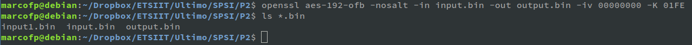

#### 8. Descrifrar output.bin utilizando la misma clave y vector de inicialización que en 7.

  `openssl aes-192-ofb -nosalt -d -in output.bin -out output-descrifrado.bin -iv 00000000 -K 01FE`

  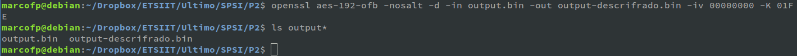

  Vemos como el contenido de output-descrifrado.bin es igual a input.bin:  

  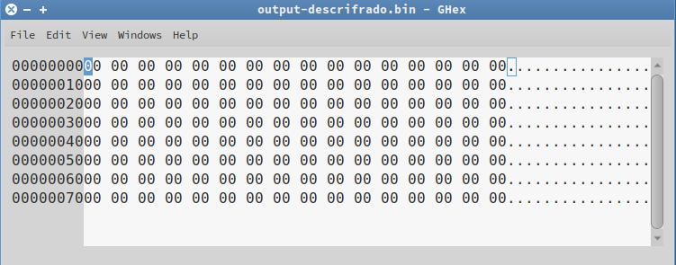

#### 9. Volver a cifrar output.bin con AES-192 en modo 0FB, clave y vector de inicialización del punto 7. Comparar el resultado con lo obtenido en el punto 8.

`openssl aes-192-ofb -nosalt -in output.bin -out output-cifrado-doble.bin -iv 00000000 -K 01FE`

  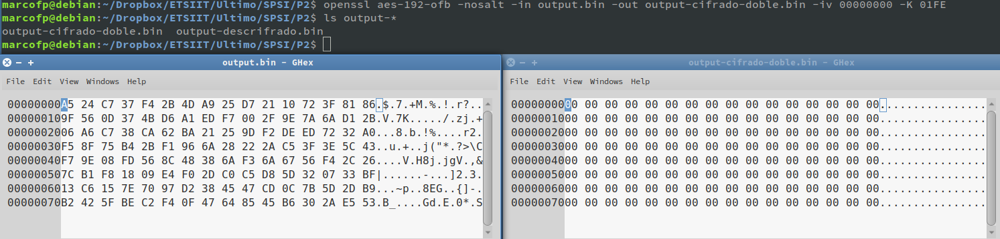

#### 10. Presentar la descripción de otro cifrado simétrico que aparezca en la implementación de OpenSSL.

**[RC4](https://en.wikipedia.org/wiki/RC4)**: RC4 es un sistema de cifrado de flujo muy utilizado, forma parte de protocolos tan populares como TLS/SSL, utilizado para cifrar el tráfico en las conexiones por internet; y también para el protocolo WEP en redes inalámbricas.  
RC4 ha sido excluído de los estándares de alta seguridad ya que se conocen formas de vulnerarlo fácilmente. Por ese motivo es muy poco recomendable emplear WEP para cifrado de redes inalámbricas.  

RC4 genera flujos pseudoaleatórios de bits (keystreams), para cifrar un texto éste se combina con los keystreams utilizando una operación XOR.  

#### 11. Repetir puntos de 3 a 5 con el cifrado presentado en el punto anterior.

Debido a que RC4 no dispone de modos ECB, CBC y OFB, para este apartado se utilizará el cifrado RC2, diseñado por el mismo creador de RC4. A diferencia de RC4, que es un cifrado de flujo, RC2 es un cifrado de bloque; aunque también es simétrico por lo tanto nos sirve para el experimento.

#####  (3) Cifrar input.bin con RC4 en modo ECB, CBC y 0FB; usando una clave débil y otra semidébil. (Cualquier vector de inicialización)

- ##### 11.1. RC2:
  - ##### 11.1.1. Modo ECB:
    - Clave débil:  
    `openssl rc2-ecb -nosalt -in input.bin -out input0-rc2-ecb-debil.enc -K 11111111`
    - Clave semidébil:  
    `openssl rc2-ecb -nosalt -in input.bin -out input0-rc2-ecb-semidebil.enc -K 01FE`
  - ##### 11.1.2. Modo CBC:
    - Clave débil:  
    `openssl rc2-cbc -nosalt -in input.bin -out input0-rc2-cbc-debil.enc -iv 00000000 -K 11111111`
    - Clave semidébil:  
    `openssl rc2-cbc -nosalt -in input.bin -out input0-rc2-cbc-semidebil.enc -iv 00000000 -K 01FE`
  - ##### 11.1.3. Modo OFB:
    - Clave débil:  
    `openssl rc2-ofb -nosalt -in input.bin -out input0-rc2-ofb-debil.enc -iv 00000000 -K 11111111`
    - Clave semidébil:  
    `openssl rc2-ofb -nosalt -in input.bin -out input0-rc2-ofb-semidebil.enc -iv 00000000 -K 01FE`  

  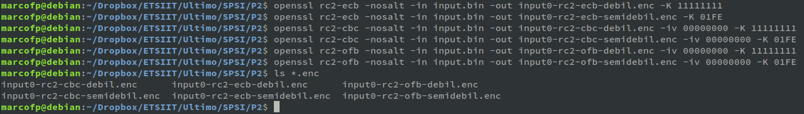

##### (4) Cifrar input.bin e input1.bin con RC2 en modo ECB y clave a elegir. Explicar la forma de los resultados obtenidos.

`openssl rc2-ecb -nosalt -in input.bin -out input0-rc2-ecb-debil.enc -K 11111111`  
`openssl rc2-ecb -nosalt -in input1.bin -out input1-rc2-ecb-debil.enc -K 11111111`  

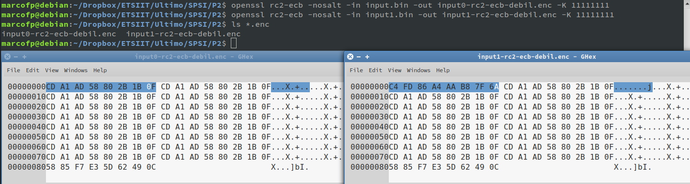

  - ##### Comparación:
  Como se ha ido observando en la práctica en este tipo de ejercicio, ambos resultados presentan patrones que se repiten en el texto cifrado y difieren en una sección que corresponde al bit de diferencia entre el fichero input.bin y input1.bin.

##### (5) Cifrar input.bin e input1.bin con RC2 en modo CBC, clave y vector de inicialización a elegir. Comparar resultados con el apartado anterior.  

`openssl rc2-cbc -nosalt -in input.bin -out input0-rc2-cbc-debil.enc -iv 00000000 -K 11111111`    
`openssl rc2-cbc -nosalt -in input1.bin -out input1-rc2-cbc-debil.enc -iv 00000000 -K 11111111`    

  - ##### Comparación:
  Como era predecible, los resultados no presentan patrones gracias a la diferencia entre los modos ECB y CBC, el uso de un vector de inicialización y la operación XOR.
