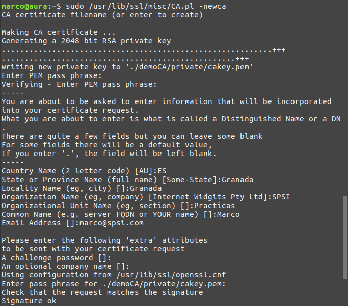
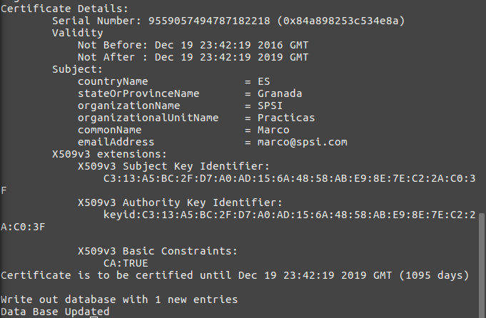
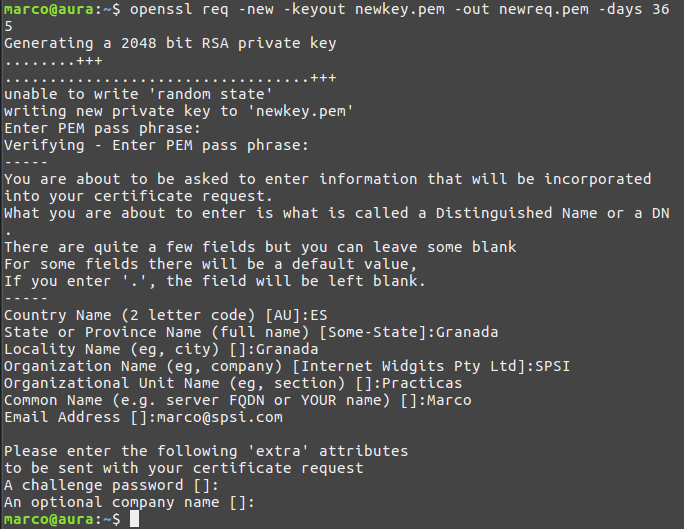
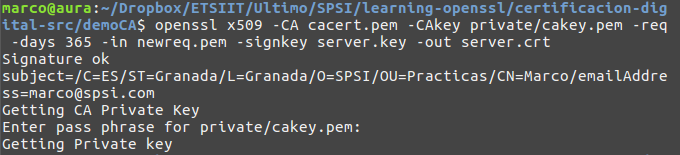
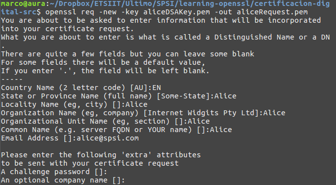
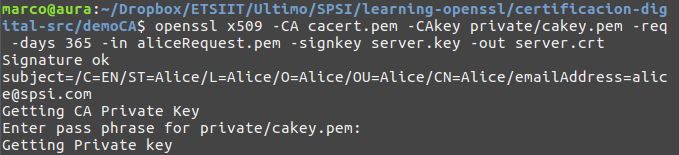

### Ejercicios de Certificación Digital

#### 1\. Cread una autoridad certicadora. En este caso se premiara el uso de openssl ca frente a CA.pl , aunque este u  ltimo comando es admisible.

Creamos el certificado digital con:  
`sudo /usr/lib/ssl/misc/CA.pl -newca`

Si quisieramos modificar los parámetros tendríamos que acceder al propio script de creación `CA.pl`.




Una vez terminado el proceso, habremos generado la autoridad demoCA.

#### 2\. Cread una solicitud de certicado que incluya la generacion de claves en la misma.

Mediante el siguiente comando creamos la solicitud y generamos las claves:  

`openssl req -new -keyout newkey.pem -out newreq.pem -days 365`

Posteriormente tendremos en newreq.pem la solicitud, y en newkey.pem la clave privada generada.



#### 3\. Cread un certificado para la solicitud anterior empleando la CA creada en el primer punto.

Primero generamos una clave RSA con:  
`openssl genrsa -out server.key 1024`  

Con ella, podremos crear el certificado a través de la solicitud que creamos anteriormente. Para ello usamos la orden:  
`openssl x509 -CA cacert.pem -CAkey private/cakey.pem -req -days 365 -in newreq.pem -signkey server.key -out server.crt`



#### 4\. Cread una solicitud de certicado para cualquiera de las claves que habeis generado en las practicas anteriores, excepto las RSA.

Para crear la solicitud utilizaremos la clave DSA creada en prácticas anteriores: `aliceDSAKey.pem`  

Y crearemos la solitud mediante la orden:  
`openssl req -new -key aliceDSAKey.pem -out aliceRequest.pem`



#### 5\. Cread un certicado para la solicitud anterior utilizando la CA creada.

Creamos el certificado de la misma forma que en el ejercicio 3:  
`openssl	x509	-CA	cacert.pem	-CAkey	cakey.pem	-req	-days	365	-
in	aliceRequest.pem	-signkey	server.key	-out	server.crt`



#### 6\. Emplead las opciones -text y -noout para mostrar los valores de todos los certi cados y solicitudes de los puntos anteriores, incluyendo el certicado raz que habra sido creado junto con la CA.

Para ello utilizamos las ordenes: `openssl x509 -in <certificado> -noout -text` si es un certificado, y `openssl req -in <peticion> -noout -text` si es una petición:


Ordern: `openssl x509 -in cacert.pem -noout -text`

Salida:

```
Certificate:
    Data:
        Version: 3 (0x2)
        Serial Number: 10396756616410332561 (0x9048b30ee9547d91)
    Signature Algorithm: sha256WithRSAEncryption
        Issuer: C=ES, ST=Granada, O=SPSI, OU=Practicas, CN=Marco/emailAddress=marco@spsi.com
        Validity
            Not Before: Dec 20 16:55:58 2016 GMT
            Not After : Dec 20 16:55:58 2019 GMT
        Subject: C=ES, ST=Granada, O=SPSI, OU=Practicas, CN=Marco/emailAddress=marco@spsi.com
        Subject Public Key Info:
            Public Key Algorithm: rsaEncryption
                Public-Key: (2048 bit)
                Modulus:
                    00:c0:66:ac:20:ca:20:46:ca:ce:42:24:eb:ec:cf:
                    82:de:d1:7c:72:ae:9c:85:d3:47:39:3a:2a:9d:e3:
                    1e:70:ea:62:f0:95:09:ae:e8:c5:88:cc:1b:31:bb:
                    e5:40:0c:7f:3b:c9:42:44:91:8d:6f:1f:f4:dd:ce:
                    21:2e:d7:f6:72:f6:43:18:9f:56:c8:0e:71:c7:f5:
                    76:7e:18:d0:fb:4d:b3:8a:9b:9b:1b:ce:ea:73:25:
                    a5:5f:2f:4e:ce:3d:e2:a8:8a:d9:6c:cd:ee:9a:4d:
                    c7:62:52:2f:1e:4b:08:65:f3:27:38:7f:ef:7c:ea:
                    47:2e:a5:24:a3:67:de:19:7d:c4:d3:0a:8d:24:93:
                    66:5e:30:e0:e3:07:ff:e4:9f:87:94:c0:6b:e4:cd:
                    b8:0b:b7:c5:a8:fe:ed:d7:13:11:42:d1:62:79:0f:
                    20:d6:6a:28:0b:a9:d7:34:23:9f:cc:dc:6a:8e:50:
                    79:11:3d:94:92:aa:b3:60:1e:f5:21:64:24:44:8f:
                    48:f4:ef:33:a5:ec:6c:f0:7c:ba:39:33:0f:4f:db:
                    76:e2:f2:f0:f0:45:18:7f:c8:4a:51:3b:1a:05:59:
                    c1:34:9f:fa:b4:1c:65:0a:de:ed:35:20:45:f3:97:
                    34:b0:84:e1:d2:96:4d:2f:72:5d:78:7b:1c:84:62:
                    65:ef
                Exponent: 65537 (0x10001)
        X509v3 extensions:
            X509v3 Subject Key Identifier:
                9F:6D:7F:06:19:1D:86:AA:F8:CE:49:84:75:57:3F:F9:EB:BB:F6:14
            X509v3 Authority Key Identifier:
                keyid:9F:6D:7F:06:19:1D:86:AA:F8:CE:49:84:75:57:3F:F9:EB:BB:F6:14

            X509v3 Basic Constraints:
                CA:TRUE
    Signature Algorithm: sha256WithRSAEncryption
         a7:8e:9d:e9:33:70:c0:d1:7c:0b:a8:0c:9b:74:cc:e0:63:c6:
         61:53:71:fc:21:5d:ea:53:4a:5b:0b:65:bf:30:81:d0:e0:0c:
         3f:ca:1a:44:a1:64:a7:80:be:25:fe:f3:ad:b8:5d:e3:58:1a:
         66:f3:d0:d1:3a:2e:a1:4a:66:8b:58:e6:7d:f2:65:e9:5a:f1:
         f7:93:f0:48:33:27:03:92:4d:92:7f:8c:33:99:cd:01:83:dc:
         34:db:64:58:41:25:5e:5d:87:fb:5c:8b:1e:31:9e:e8:4f:e2:
         49:56:fb:96:a2:7a:dc:c4:05:f9:20:d6:33:c9:86:89:55:a5:
         57:32:f9:c6:1f:bf:0e:f4:97:2c:2d:10:1c:57:56:a8:e7:2b:
         c7:d1:a0:c8:94:d7:68:e6:d1:e3:3c:87:33:a2:0a:f1:db:20:
         6d:ff:86:22:9e:fd:ee:3f:74:de:49:0e:aa:a9:ba:9f:83:89:
         fb:8b:d3:b6:5f:2e:96:68:58:cf:7f:1d:d3:81:b4:9e:50:39:
         e7:03:4e:30:92:f9:4c:fb:21:bc:17:14:88:ae:23:62:ad:bb:
         58:29:b5:8f:69:1f:bb:eb:0d:60:aa:85:c2:d8:68:13:d3:6d:
         70:bc:eb:d2:b8:9b:dd:b6:06:b8:63:7d:55:93:be:97:41:98:
         11:e1:0a:57
```

Orden: `openssl req -in newreq.pem -noout -text`

Salida:

```
Certificate Request:
    Data:
        Version: 0 (0x0)
        Subject: C=ES, ST=Granada, L=Granada, O=SPSI, OU=Practicas, CN=Marco/emailAddress=marco@spsi.com
        Subject Public Key Info:
            Public Key Algorithm: rsaEncryption
                Public-Key: (2048 bit)
                Modulus:
                    00:bc:41:38:e3:d5:40:17:93:bf:68:f6:d5:79:94:
                    63:05:d4:6e:42:76:fd:69:31:f0:93:c9:07:be:70:
                    a2:49:30:29:89:b5:87:c7:8d:ad:25:be:8c:fe:75:
                    cc:da:ae:c6:32:8a:09:51:92:fd:e5:27:30:27:90:
                    00:28:7d:b1:82:a2:37:59:be:12:9b:95:0b:4e:98:
                    ee:a4:1b:13:58:98:b9:d2:19:aa:4e:fb:9b:33:7d:
                    20:cc:1c:b9:6c:85:0d:b7:89:23:2a:5e:6b:e9:5b:
                    85:03:23:d6:8b:50:84:9b:df:57:d7:07:a9:f0:3d:
                    ee:d0:79:d6:7f:9b:13:23:68:de:9d:4a:b8:58:5e:
                    db:3a:93:98:22:97:63:6d:20:eb:ca:e3:27:32:d0:
                    b9:c6:ae:9b:8e:66:81:be:af:10:70:f4:a8:68:1c:
                    bb:41:52:3e:16:20:ca:80:86:28:c4:3a:5d:a7:50:
                    eb:76:d3:52:48:a5:8c:fc:e5:9c:aa:f4:8a:9c:2f:
                    8d:1b:6d:3d:b8:c4:61:ca:15:46:80:0e:5d:70:b1:
                    57:5a:7d:a5:6d:61:5d:6d:c3:94:b4:b2:42:e0:8a:
                    71:55:59:26:2f:82:3a:15:d3:b9:49:09:24:a3:60:
                    30:f3:ec:f4:f3:b7:e5:b2:16:03:f2:b8:84:bd:b8:
                    9e:a3
                Exponent: 65537 (0x10001)
        Attributes:
            a0:00
    Signature Algorithm: sha256WithRSAEncryption
         31:b3:30:37:40:59:8b:9d:0a:50:74:60:98:eb:c0:6c:ac:66:
         99:2a:40:c8:68:39:63:90:0d:52:d4:40:05:de:66:95:f9:de:
         a8:66:7c:3b:0e:c7:7c:22:cc:6e:d8:03:09:ca:82:dc:80:85:
         4d:75:dc:48:85:a7:c5:24:66:bc:4b:64:11:95:20:f7:20:df:
         28:44:a1:4b:b7:14:60:88:01:ff:f7:73:bf:1c:f7:c2:3d:e9:
         9f:aa:01:28:21:fa:4d:b4:35:15:79:31:e2:c2:90:30:f6:3f:
         46:c2:fa:82:33:df:87:13:56:d8:b8:64:37:e7:ec:79:fd:56:
         cb:2f:40:d9:60:b2:c0:78:cb:34:66:04:1f:5a:89:c1:53:14:
         b7:69:e8:9d:bc:f9:d1:3d:b1:d5:95:a2:74:17:47:7e:05:db:
         a0:de:18:ba:27:df:0a:ea:1d:3b:9a:ff:77:81:1a:f9:39:4d:
         d8:d1:af:88:7e:f7:d5:21:06:75:34:2c:f9:71:3e:86:7d:b9:
         ba:e8:1f:d5:12:c3:f4:07:92:ae:00:09:d5:67:39:93:1d:ec:
         05:61:d9:64:52:1e:f6:38:40:22:16:32:39:6b:15:e2:09:c1:
         e5:7a:2b:44:60:8c:9c:12:bd:70:08:44:4e:88:73:43:14:fa:
         08:03:d9:d3
```

Orden: `openssl x509 -in server.crt -noout -text`

Salida:

```
Certificate:
    Data:
        Version: 1 (0x0)
        Serial Number: 4886718350 (0x12345678e)
    Signature Algorithm: sha256WithRSAEncryption
        Issuer: C=EN, ST=Alice, L=Alice, O=Alice, OU=Alice, CN=Alice/emailAddress=alice@spsi.com
        Validity
            Not Before: Dec 20 17:20:35 2016 GMT
            Not After : Dec 20 17:20:35 2017 GMT
        Subject: C=EN, ST=Alice, L=Alice, O=Alice, OU=Alice, CN=Alice/emailAddress=alice@spsi.com
        Subject Public Key Info:
            Public Key Algorithm: rsaEncryption
                Public-Key: (1024 bit)
                Modulus:
                    00:da:49:1a:d2:92:cb:31:c3:c5:12:44:47:1c:b8:
                    f3:43:68:f1:6d:68:03:5c:28:f1:70:8f:bb:72:ac:
                    f6:a4:06:1a:62:66:f3:3e:86:2f:cf:05:f2:4b:17:
                    ec:e2:0c:18:30:85:25:65:fe:c2:c7:ec:1a:0b:85:
                    2e:96:6c:48:7f:86:9d:7a:c9:fb:2b:af:f4:25:a9:
                    d0:b3:c2:4c:95:d4:6e:54:c7:d2:46:c9:94:51:89:
                    81:ec:d2:4e:a7:38:b8:19:f5:05:ce:5a:ef:5c:51:
                    1a:b4:bd:9f:e4:b3:33:40:b0:2e:42:20:e6:ae:50:
                    d8:1f:3f:c3:e5:3b:91:a1:19
                Exponent: 65537 (0x10001)
    Signature Algorithm: sha256WithRSAEncryption
         8b:bb:0f:d7:ae:97:d2:5a:c9:f2:29:e8:cd:94:fa:46:b0:ed:
         c0:f9:a2:8e:ad:b7:36:94:bb:6e:ea:5c:be:20:93:60:91:5f:
         cd:12:aa:45:91:49:a4:4c:dd:97:78:7d:db:b6:f4:f2:38:8e:
         39:eb:a5:37:3e:92:96:4a:6a:ff:a1:26:3d:bf:f4:2b:19:54:
         13:76:71:c4:0b:e8:33:56:ef:b0:7c:c1:95:22:71:45:08:c1:
         c5:4c:af:e0:78:49:5e:30:ea:10:d2:ee:f4:30:77:1a:b5:d6:
         91:ef:b1:22:eb:3a:42:1c:b1:65:9c:0c:b2:86:d6:00:f8:09:
         c5:ff
```

Orden: `openssl req -in aliceRequest.pem -noout -text`

Salida:

```
Certificate Request:
    Data:
        Version: 0 (0x0)
        Subject: C=EN, ST=Alice, L=Alice, O=Alice, OU=Alice, CN=Alice/emailAddress=alice@spsi.com
        Subject Public Key Info:
            Public Key Algorithm: dsaEncryption
                pub:
                    70:30:f3:bc:fb:0f:79:ed:fe:e6:f2:f8:b0:2f:99:
                    d5:11:26:02:47:71:be:d0:32:bd:9b:ff:61:43:39:
                    de:54:d2:7c:2b:6b:9d:f7:90:6c:33:17:93:d9:c4:
                    ed:66:c9:3d:5a:af:41:95:af:7c:da:ee:95:98:64:
                    7f:55:71:fc:3e:6b:3d:13:13:b9:65:de:86:70:51:
                    b6:2b:fe:fc:17:80:a0:c7:84:d1:77:28:d0:d7:07:
                    d2:3b:88:7c:b5:4c:5e:cf:bb:60:9a:e4:c4:90:77:
                    22:e8:53:ee:71:d8:d2:f3:56:69:7e:85:0a:b3:a3:
                    45:1f:c2:b1:61:2d:a3:82
                P:   
                    00:d6:29:97:89:4a:08:81:8e:65:80:1b:5e:fb:9d:
                    23:93:35:de:a6:4c:19:5e:a4:80:48:fb:ed:ea:b6:
                    c6:ee:96:7e:f8:28:1a:f6:57:cc:f0:13:69:bf:d7:
                    2b:7b:28:e6:e5:4d:d9:4d:db:97:8e:86:4c:bc:d7:
                    96:01:ad:c9:69:4c:56:50:cb:e7:33:98:db:39:d4:
                    24:59:ae:e6:88:8c:60:83:eb:6e:4a:9c:0c:74:d7:
                    aa:e9:1c:52:11:93:b3:84:64:96:3a:83:26:e0:9c:
                    b7:2d:d6:e0:a1:7e:a6:17:7a:78:41:7a:47:c7:c0:
                    b0:d7:55:9f:8b:6c:8e:8f:d9
                Q:   
                    00:af:67:41:db:14:63:6a:c5:63:94:c7:6d:09:f3:
                    0f:0b:67:51:cb:ad
                G:   
                    1c:1f:63:e7:75:03:1f:b6:88:b4:41:8e:e6:21:af:
                    a1:66:5d:46:86:d9:bc:16:bf:90:7f:ca:6f:ab:c0:
                    ee:c5:5b:77:67:90:e2:fd:38:1a:9c:0c:76:0c:46:
                    0e:34:cf:81:d6:65:33:d8:58:68:7b:a4:2b:91:ce:
                    2b:4b:97:e6:2c:53:58:bc:ed:2a:ec:ca:85:c2:f4:
                    14:63:67:3f:4e:ca:50:de:58:a6:9a:24:73:f0:14:
                    ad:22:1f:e3:67:25:fe:79:0a:0c:40:94:5b:5d:67:
                    0c:3e:46:9b:31:0b:cf:c9:4a:53:dc:72:98:b7:35:
                    f3:4a:82:8a:55:3e:b6:a4
        Attributes:
            a0:00
    Signature Algorithm: dsa_with_SHA256
         r:   
             0d:b4:63:b2:e6:dd:a4:f8:bf:b5:03:b6:9d:63:ba:
             b9:b7:a3:2f:aa
         s:   
             00:ab:15:60:3f:f0:b6:38:28:97:cf:81:ba:2c:c2:
             46:ca:a3:53:f8:2e
```
