# Ejercicios de claves asimétricas

* Contraseña utilizada: `0123456789`
* Para generar par de claves: `openssl genrsa`
* Para extraer claves, manipularlas y/o cifrarlas: `openssl rsa`
* Para descifrar, cifrar, firmar y verificar con las claves dadas: `openssl rsautl`
* Para generar y manipular parámetros asociados a curvas elípticas y parejas de claves: `openssl ecparam`
* Para extraer y/o manipular claves a partir de curvas elípticas: `openssl ec`
* Para generar claves aleatorias de sesión: `openssl rand`

* Usas flags `--text` y `--noout` para visualizar salida de claves.

## Tareas a realizar

#### 1. Generar dos pares de claves RSA de 1024 bits. No protegida por contraseña.

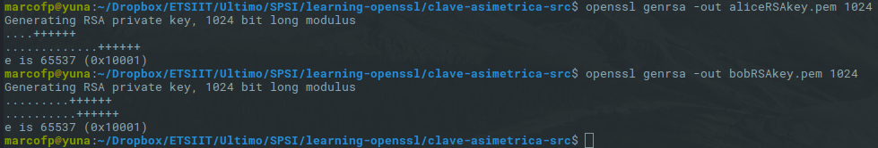

#### 2. Extraer la clave privada contenida en en cada uno de los pares, a otro archivo protegido por contraseña cifrándolo con AES-128. Mostrar sus valores.

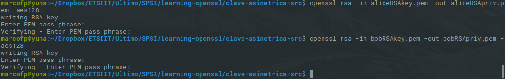

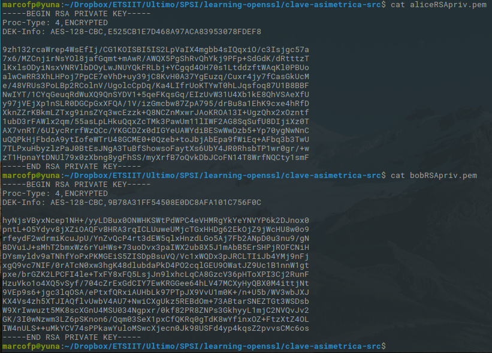

#### 3. Extraer la clave publica de cada uno de los pares. No debe estar cifrada ni protegida. Mostrar sus valores.

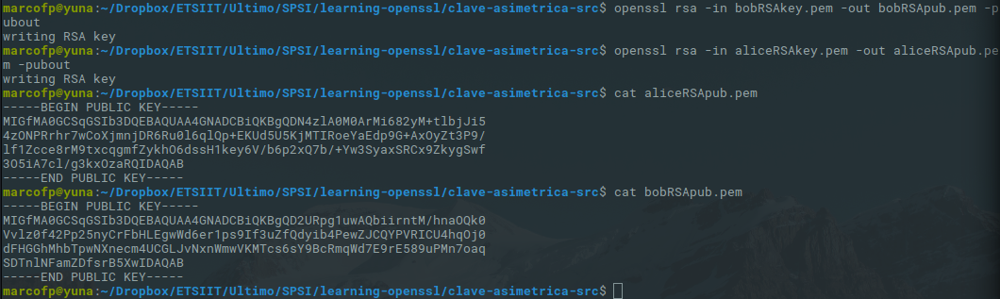

#### 4. Reutilizar el archivo input.bin de 1024 bits, todos a 0, cifrandolo con las claves publicas y explicar el resultado.

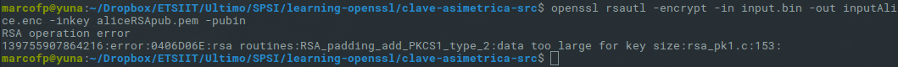

Con un criptosistema de claves públicas y privadas no podemos cifrar archivos de gran tamaño, por lo tanto, será necesario utilizar además un cifrado simétrico calculando de forma aleatoria su clave gracias a OpenSSL, y ésta clave será la cifrada con la clave pública de cada punto.

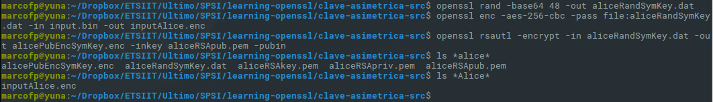

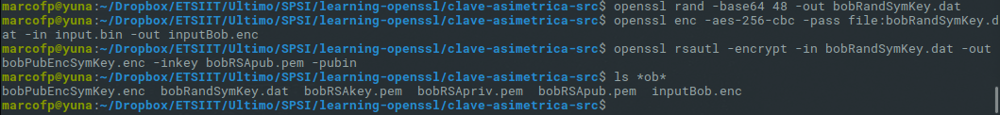

#### 5. Diseñar un cifrado híbrido, con RSA como sistema asimétrico para enviar información entre dos puntos. Las claves de sesión para el algoritmo simétrico deben ser aleatorias, generadas con `openssl rand` y luego utilizar ese archivo para generar clave y vector de inicialización mediante la opción `-kfile`.

El criptosistema seguirá el mismo principio que el ejercicio anterior, generaremos claves simetricas, cifraremos los archivos a enviar con ella, y posteriormente las cifraremos en el punto emisor con la clave publica, y las descifraremos con la clave privada en el punto receptor. De forma que el receptor pueda con ella descifrar el archivo enviado y leer el contenido en texto plano.

* Generación de clave simétrica aleatoria:   
  `openssl rand -base64 48 -out <claveSym>.dat`

* Cifrado de archivo con clave simétrica:   
`openssl enc -aes-256-cbc -pass file:<claveSym>.dat -in <archivoTextoPlano>.bin -out <archivoCifrado>.enc`

* Cifrado de clave simétrica utilizando clave pública (Emisor):  
`openssl rsautl -encrypt -in <claveSym>.dat -out <claveSymCifrada>.enc -inkey <clavePublica>.pem -pubin`

En este punto tenemos el archivo cifrado (con clave simetrica), y la clave simetrica cifrada (con la clave pública). Enviamos ambos archivos al receptor, y éste podrá leer el contendido efectuando los siguientes pasos:

* Descifrado de clave simétrica utilizando clave privada:  
`openssl rsautl -decrypt -inkey <clavePrivada>.dat -in <claveSymCifrada>.enc -out <claveSymTextoPlano>.dat`

* Descifrado de archivo utilizando la clave simétrica:  
`openssl enc -aes-256-cbc -d -pass file:<claveSymTextoPlano>.dat -in <archivoCifrado>.enc -out <archivoTextoPlano>.dat`

#### 6. Utilizando el criptosistema híbrido diseñado, cifrar en ambos puntos el archivo input.bin con la clave pública del punto contrario. Descifrar en cada punto con la clave privada y comparar el resultado con el archivo original.

* Cifrado de archivos:
  * Alice files ( Hecho por Bob ):  
  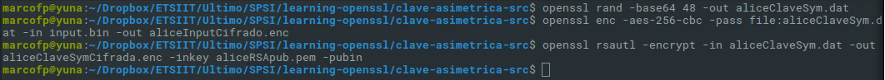

  * Bob files ( Hecho por Alice ):  
  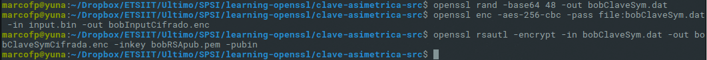

* Descifrando de archivos:
  * Alice ( Hecho por Alice ):  
  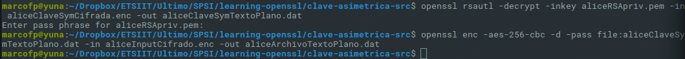

  * Bob ( Hecho por Bob ):  
  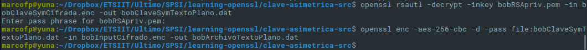

* Comparación de archivos:

  * Inputs descifrados:
  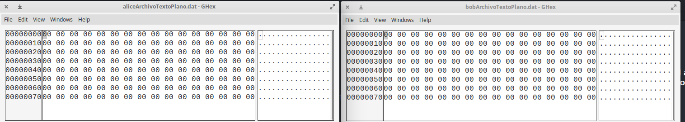

  * Claves simetricas descifradas:  
  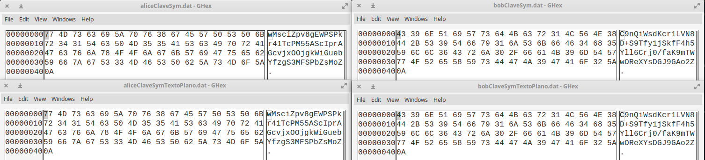

Vemos que los archivos coinciden, tanto la clave simetrica como el archivo cifrado con ella, en ambos puntos de la comunicación.

#### 7. Generar un archivo que contenga los parámetros públicos de una de las curvas elípticas contenidas en las transparencias de teoría. Si no se logran localizar hacer el resto de ejercicios con una curva cualquiera de las disponibles en OpenSSL. Mostrar los valores.

#### 8. Generar dos pares de claves para los parámetros anteriores. No protegidas por contraseña.

#### 9. Extraer la clave privada contenida en el archivo  de cada clave, protegido por contraseña cifrandolo con 3DES. Mostrar sus valores.

#### 10. Extraer la clave pública contenida en el archivo de cada clave, sin protegerlo con contraseña.
