### Ejercicios de Protocolos criptográficos

- Contraseña utilizada: `0123456789`

#### 1\. Generad un archivo sharedDSA.pem que contenga los parámetros. Mostrad los valores.

Orden ejecutada: `openssl dsaparam -out sharedDSA.pem 1024`  

  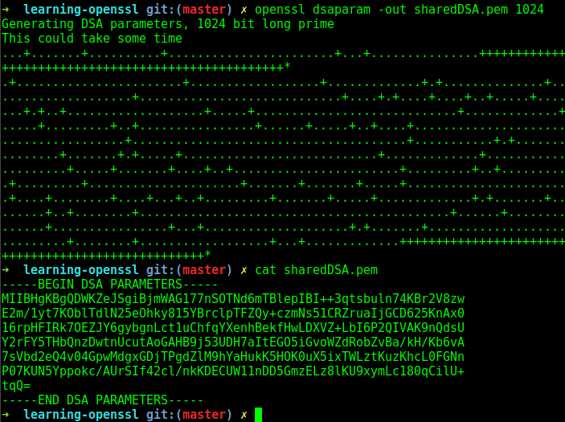

#### 2\. Generad cada uno de vosotros una clave para los parámetros anteriores. La clave se almacenará en nombreDSAkey.pem y no es necesario protegerla por contraseña.

Orden ejecutada: `openssl gendsa -out <nombre>DSAKey.pem sharedDSA.pem`  

  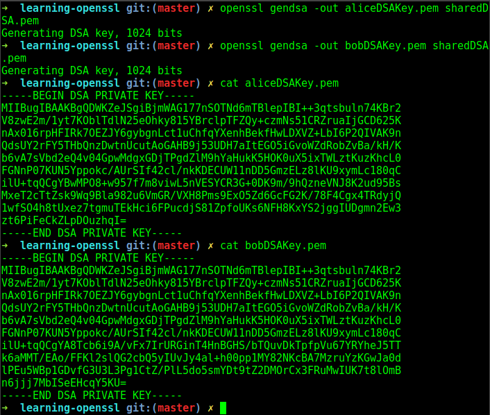

#### 3\. "Extraed" la clave privada contenida en el archivo nombreDSAkey.pem a otro archivo que tenga por nombre nombreDSApriv.pem . Este archivo deberá estar protegido por contraseña. Mostrad sus valores.

Orden ejecutada: `openssl dsa -in <nombre>DSAKey.pem -des3 -out <nombre>DSApriv.pem`  

  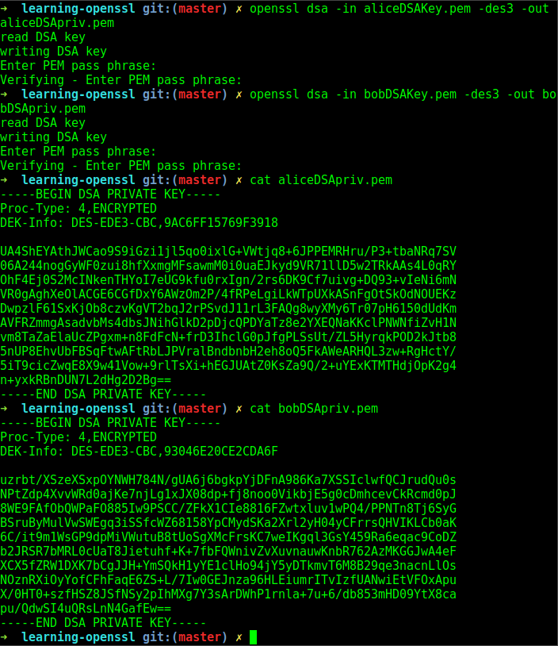  

Para leer el contenido de la clave: `openssl dsa -in <nombre>DSApriv.pem -text`

  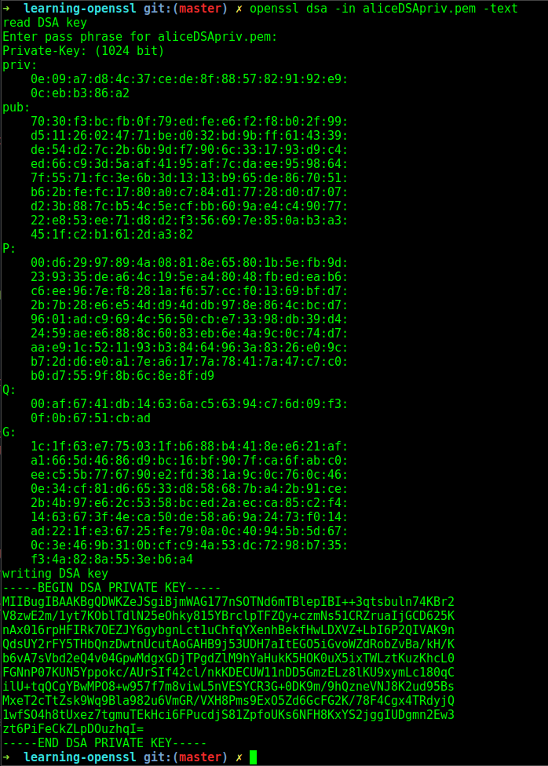   

#### 4\. Extraed en nombreDSApub.pem la clave pública contenida en el archivo nombreDSAkey.pem . De nuevo nombreDSApub.pem no debe estar cifrado ni protegido. Mostrad sus valores.

Orden ejecutada: `openssl dsa -in <nombre>DSAKey.pem -des3 -out <nombre>DSApub.pem -pubout`

   

#### 5\. Calculad los valores hash del archivo con la clave pública nombreDSApub.pem usando dos funciones hash, sha256 y otra a elegir. Mostrad los valores por salida estándar y guardadlo en nombreDSApub.sha256 y nombreDSApub.[otro].

Orden para generar el hash con SHA256: `echo -n <nombre>DSApub.pem | sha256sum > <nombre>DSApub.sha256`

Orden para generar el hash con MD5: `echo -n <nombre>DSApub.pem | md5sum > <nombre>DSApub.md5`  

#### 6\. Generad el valor HMAC del archivo sharedDSA.pem con clave '12345' mostrándolo por pantalla.  

Orden ejecutada: `openssl dgst -hmac '12345' sharedDSA.pem > sharedDSA.hmac`

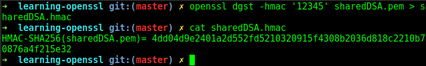

#### 7\. Simulad el protocolo Estación a Estación. Para ello emplearemos como claves para firma/verificación las generadas en esta práctica, y para el protocolo DH emplead las claves asociadas a curvas elípticas de la práctica anterior. Por ejemplo, si mi clave privada está en javierECpriv.pem y la clave pública del otro usuario está en lobilloECpub.pem, el comando para generar la clave derivada será $> openssl pkeyutl -inkey javierECpriv.pem-peerkey lobilloECpub.pem -derive -out key.bin. El algoritmo simétrico a utilizar será AES-128

Primero generamos las claves derivadas, a partir de las privadas de cada usuario con la pública del otro.

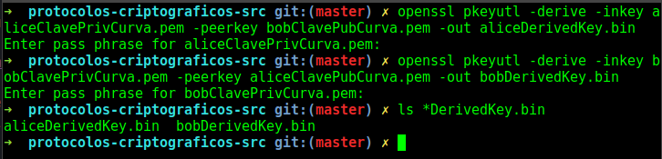

Concatenamos ambas claves en un único archivo para poder firmarlo.

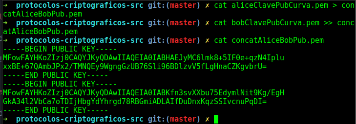

Finalmente realizamos ciframos la firma:

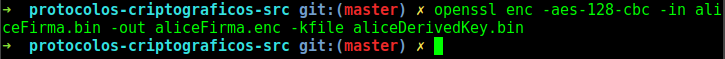

Desde el otro punto de la comunicación, se descifra la firma:

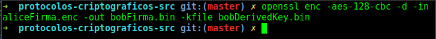

Concatenamos las claves publicas al revés:

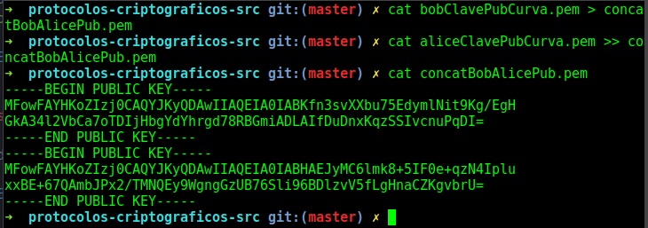

Y verificamos:

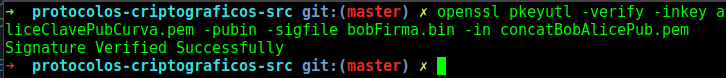

Se firma la concatenación de las claves y se cifra antes de enviar al otro punto:

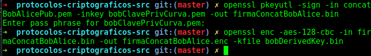

Una vez recibido por el punto contrario de la comunicación, solo queda descifrarlo y verificarlo:

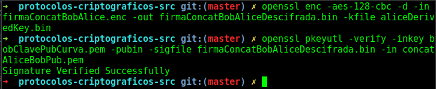
